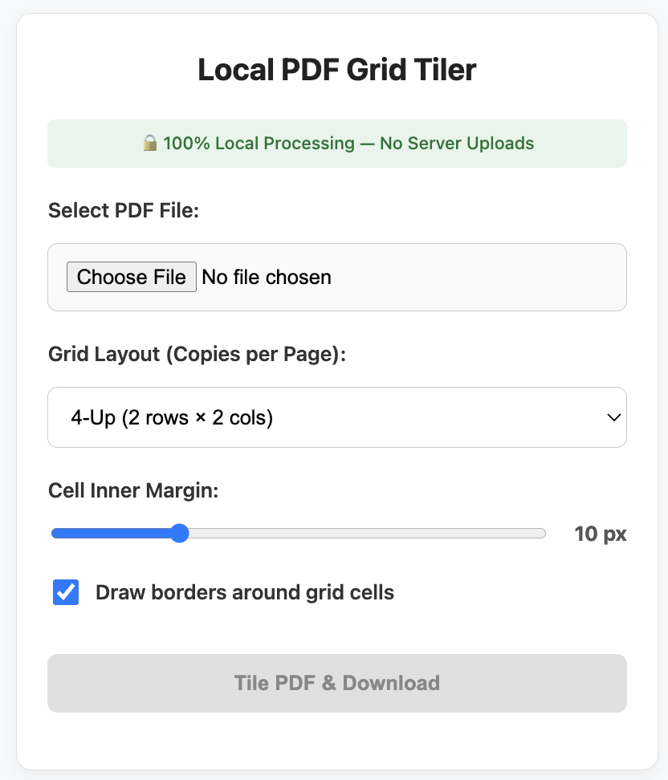

# Local Grid Tiler

🚀 **[Live Demo](https://kylemath.github.io/pdfTiles)** 🚀

A single-file browser tool that tiles a PDF or image into any rows × columns grid layout and downloads the result as a PDF — entirely on your device, with no server involved at any step.



---

## What it does

Open `index.html` in any modern browser. Select a PDF or image file, set the number of rows and columns, adjust cell margins, toggle borders, choose orientation, and click **Tile & Download**. The tiled PDF lands in your downloads folder in seconds.

### Input formats

| Type | Formats |
|------|---------|
| PDF | `.pdf` — first page is tiled |
| Images | `.jpg`, `.png`, `.gif`, `.webp`, `.bmp`, `.tiff` |

JPEG files are embedded directly. All other image formats are converted to PNG in-browser before embedding.

### Grid layout

Instead of fixed presets, you set **rows** and **columns** independently — any value from 1 to 10 each, up to 100 copies per page. The default is 2 rows × 2 columns (4 copies). A live copy count updates as you type.

### Options

| Option | Default | Description |
|--------|---------|-------------|
| Rows | 2 | Number of grid rows (1–10) |
| Cols | 2 | Number of grid columns (1–10) |
| Cell inner margin | 10 px | Padding inside each grid cell |
| Draw borders | On | Draws a light gray border around each cell |
| Landscape output | Off | Rotates the output page to horizontal (792 × 612 pt) |

### Live preview

A small canvas preview appears as soon as a file is loaded and updates instantly whenever any setting changes. It shows the actual image content for image inputs and a document placeholder for PDFs.

---

## Zero-trust local processing

This tool is designed so that your documents never leave your machine under any circumstances.

### How processing works

1. The browser reads the file you select using the standard [File API](https://developer.mozilla.org/en-US/docs/Web/API/File_API) — the bytes go directly into JavaScript memory, not to any server.
2. [pdf-lib](https://pdf-lib.js.org/) (bundled locally, see below) tiles the content entirely in-process. For non-JPEG images, an off-screen `<canvas>` handles the format conversion before embedding.
3. The finished PDF is handed back to you via a `blob:` URL and a simulated download link — a browser-native mechanism that opens no network socket.

At no point does the tool make an upload request, POST form data, or call any external API with your file.

### Security measures in the code

**No outbound network calls from JavaScript**
A [Content Security Policy](https://developer.mozilla.org/en-US/docs/Web/HTTP/CSP) meta tag is embedded in the page:
```
connect-src 'none'; object-src 'none'; base-uri 'none';
```
This instructs the browser to block any `fetch()`, `XMLHttpRequest`, `WebSocket`, or `sendBeacon()` call made by any script on the page — even if a dependency were somehow compromised.

**pdf-lib bundled locally — zero CDN calls**
The PDF processing library (`pdf-lib.min.js`, v1.17.1) is included directly in this repository. The page loads it with a relative path (`src="pdf-lib.min.js"`), so opening `index.html` makes **no outbound network requests whatsoever** — it works completely offline.

> Previously the library was loaded from unpkg.com. Before removing that dependency, a Subresource Integrity (SRI) hash was verified (`sha384-weMABwrltA6...`) to confirm the local copy is byte-for-byte identical to the published package.

**Blob URL cleanup**
After the download is triggered, `URL.revokeObjectURL()` is called to release the in-memory blob and prevent memory leaks. Preview image blob URLs are also revoked immediately after the image loads.

**No analytics or telemetry**
There are no third-party scripts, tracking pixels, analytics SDKs, or remote logging of any kind.

---

## Usage

No build step, no server, no installation required.

```bash
# Open directly in your default browser
open index.html        # macOS
start index.html       # Windows
xdg-open index.html    # Linux
```

Or just double-click `index.html` in Finder / File Explorer.

---

## Platform compatibility

| Platform | Browser | Support |
|----------|---------|---------|
| Windows | Chrome, Edge, Firefox | Full |
| macOS | Safari, Chrome, Firefox | Full |
| Android | Chrome | Full |
| iOS 13+ | Safari | Partial — PDF opens in viewer or share sheet rather than auto-saving (browser limitation, not a security issue) |
| iOS (any) | Chrome / Firefox | Partial — same WebKit behavior as Safari |

---

## Files

```
index.html       — the entire application (single file, no build)
pdf-lib.min.js   — pdf-lib v1.17.1 (bundled locally, no CDN dependency)
screenshot.png   — UI screenshot used in this README
```

---

## Dependencies

| Library | Version | Source |
|---------|---------|--------|
| [pdf-lib](https://github.com/Hopding/pdf-lib) | 1.17.1 | Bundled locally (`pdf-lib.min.js`) |

No npm, no bundler, no build toolchain needed.
